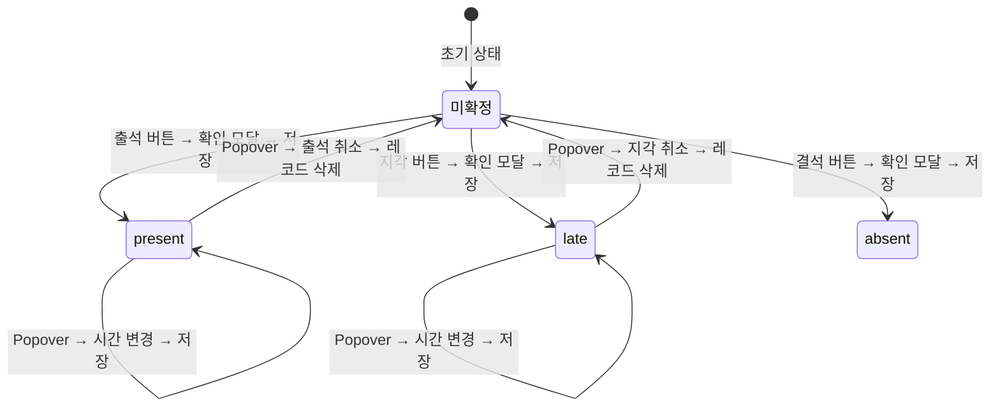
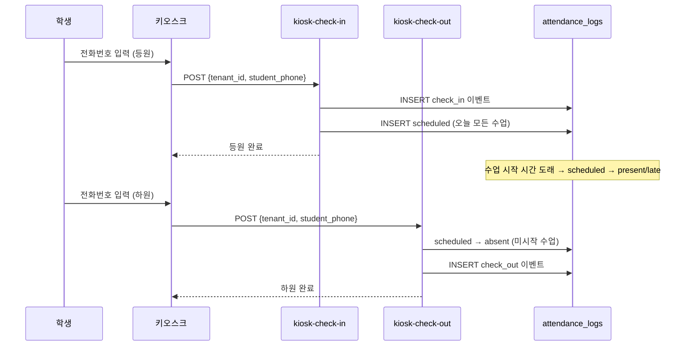

# 출결 로직 정의서

**문서 성격**: SSOT (Single Source of Truth) — 출결 시스템의 모든 비즈니스 로직 정의
**최종 업데이트**: 2026-02-07
**대상**: 개발자, AI 에이전트

---

## 1. 개요

SAMDLE(디어쌤) 플랫폼의 출결 시스템은 **이중 레코드 패턴(Dual-Record Pattern)**을 기반으로, 등원/하원 이벤트와 수업별 출석 상태를 분리하여 관리한다.

### 아키텍처 레이어

```
키오스크 / Admin UI (AttendancePage)
    ↓
React Query Hooks (use-attendance)
    ↓
Service Layer (attendance-service)
    ↓
Industry Layer (industry-academy)
    ↓
Supabase RPC (upsert_attendance_log)
    ↓
attendance_logs (파티션 테이블, RLS)
```

---

## 2. 데이터 모델

### 2.1 attendance_logs 테이블 스키마

| 컬럼 | 타입 | Nullable | 설명 |
|------|------|----------|------|
| `id` | bigserial | NOT NULL | PK (파트 1) |
| `tenant_id` | uuid | NOT NULL | FK tenants, RLS 격리 |
| `student_id` | uuid | NOT NULL | FK persons |
| `class_id` | uuid | NULL 허용 | FK academy_classes |
| `occurred_at` | timestamptz | NOT NULL | PK (파트 2), 파티션 키 |
| `attendance_type` | text | NULL 허용 | `'check_in'`, `'check_out'`, `NULL` |
| `status` | text | NULL 허용 | `'present'`, `'late'`, `'absent'`, `'excused'`, `'scheduled'`, `NULL` |
| `check_in_method` | text | NULL 허용 | `'manual'`, `'kiosk_phone'`, `'qr_scan'`, `'phone_auth'` |
| `notes` | text | NULL 허용 | 메모 |
| `created_by` | uuid | NULL 허용 | FK auth.users |
| `created_at` | timestamptz | NOT NULL | 생성 시각 (DEFAULT now()) |

> **소스**: `infra/supabase/supabase/migrations/20200101000024_create_attendance_logs_complete.sql`

### 2.2 이중 레코드 패턴 (Dual-Record Pattern)

하나의 출결 행위가 두 종류의 레코드로 분리된다.

| 레코드 유형 | attendance_type | class_id | status | 용도 |
|------------|----------------|----------|--------|------|
| **이벤트 레코드** | `'check_in'` 또는 `'check_out'` | `NULL` | `NULL` | 등원/하원 시각 기록 |
| **수업 출석 레코드** | `NULL` | NOT NULL | NOT NULL | 수업별 최종 출석 상태 |

**예시: 학생이 09:05에 등원, 10:00 수학 수업 지각 처리**
```
레코드 1 (이벤트): { attendance_type: 'check_in', occurred_at: '09:05', class_id: null, status: null }
레코드 2 (수업):   { attendance_type: null, occurred_at: '09:05', class_id: '수학-id', status: 'late' }
```

> **소스**: `infra/supabase/supabase/migrations/20260128010000_add_scheduled_status.sql`

### 2.3 CHECK 제약조건

| 규칙 | 조건 | 의미 |
|------|------|------|
| 규칙 1 | `attendance_type IN ('check_in','check_out')` → `class_id IS NULL` | 이벤트 레코드에 수업 ID 불가 |
| 규칙 2 | `attendance_type IN ('check_in','check_out')` → `status IS NULL` | 이벤트 레코드에 상태 불가 |
| 규칙 3 | `attendance_type IS NULL` → `class_id IS NOT NULL` | 수업 레코드에 수업 ID 필수 |
| 규칙 4 | `attendance_type IS NULL` → `status IS NOT NULL` | 수업 레코드에 상태 필수 |

### 2.4 파티셔닝 전략

- **방식**: `RANGE` by `occurred_at`
- **파티션**: 연도별 (2025~2075, 50년 사전 생성)
- **PK**: `(id, occurred_at)` 복합키

### 2.5 핵심 인덱스

| 인덱스 | 컬럼 | 용도 |
|--------|------|------|
| tenant_occurred | `(tenant_id, occurred_at DESC)` | 테넌트별 날짜 조회 |
| student | `(student_id, occurred_at DESC)` | 학생 이력 조회 |
| class | `(class_id, occurred_at DESC)` | 수업별 출석 조회 |
| scheduled_status | `(tenant_id, status, occurred_at) WHERE status='scheduled'` | 자동 전환 대상 |
| UNIQUE | `(tenant_id, student_id, DATE(occurred_at), attendance_type)` | UPSERT 지원 |

### 2.6 RLS 정책

```sql
-- 테넌트 격리 (JWT claim 기반)
CREATE POLICY tenant_isolation_attendance_logs ON attendance_logs
  FOR ALL TO authenticated
  USING (tenant_id = (auth.jwt() ->> 'tenant_id')::uuid)
  WITH CHECK (tenant_id = (auth.jwt() ->> 'tenant_id')::uuid);
```

---

## 3. TypeScript 타입 정의

### 3.1 Core 타입

> **소스**: `packages/industry/industry-academy/src/types.ts`

```typescript
type AttendanceType = 'check_in' | 'check_out' | 'absent' | 'late';
type AttendanceStatus = 'present' | 'late' | 'absent' | 'excused' | 'scheduled';

interface AttendanceLog {
  id: string;
  tenant_id: string;
  student_id: string;
  class_id?: string | null;
  occurred_at: string;
  attendance_type: AttendanceType | null;
  status: AttendanceStatus | null;
  check_in_method?: 'manual' | 'kiosk_phone' | 'qr_scan' | 'phone_auth';
  notes?: string;
  created_by?: string;
  created_at: string;
}
```

### 3.2 UI 타입

> **소스**: `apps/academy-admin/src/components/attendance/types.ts`

```typescript
interface StudentAttendanceState {
  student_id: string;
  check_in: boolean;           // 등원 여부
  check_out: boolean;          // 하원 여부
  status: AttendanceStatus | null;  // null = 미확정
  check_in_time?: string;      // HH:mm
  check_out_time?: string;     // HH:mm
  ai_predicted?: boolean;      // AI 예측 여부
  user_modified?: boolean;     // 사용자 수정 여부
  manual_status_override?: boolean; // 수동 상태 재정의
}

// History 탭용 (scheduled 제외)
type HistoryAttendanceStatus = 'present' | 'late' | 'absent' | 'excused';
```

---

## 4. 상태 정의

| status | 한글명 | 정의 | 적용 조건 |
|--------|--------|------|----------|
| `present` | 출석 | 정상 출석 | 수업 시작 전 또는 **10분 이내** 도착 |
| `late` | 지각 | 지연 도착 | 수업 시작 후 **10분 초과** 도착 |
| `absent` | 결석 | 미출석 | 수업에 출석하지 않음 |
| `excused` | 인정결석 | 사유 있는 결석 | 관리자가 수동으로 설정 |
| `scheduled` | 예정 | 등원 완료, 수업 미시작 | 키오스크 등원 시 자동 생성 |
| `null` | 미확정 | 레코드 없음 | 초기 상태 |

**[불변 규칙] 지각 판정 기준**: `LATE_THRESHOLD_MINUTES = 10`

> **소스**: `apps/academy-admin/src/components/attendance/constants.ts`

---

## 5. 상태 전이 규칙

### 5.1 수동 플로우 (Admin UI)



**버튼 클릭 동작** (`StudentAttendanceRow.tsx`):

| 현재 상태 | 클릭 버튼 | 동작 |
|-----------|----------|------|
| 미확정 | 출석/지각 | 확인 모달 표시 → 현재 시간으로 저장 |
| 미확정 | 결석 | 확인 모달 표시 → 결석 저장 |
| 출석 (시간 있음) | 출석 | Popover (출석 취소 / 시간 변경) |
| 지각 (시간 있음) | 지각 | Popover (지각 취소 / 시간 변경) |

**모달 본문 문구**:
- 출석 확인: "지금 시간으로 출석 처리를 하시겠어요?" + "먼저 출석 처리 후 시간 변경이 가능합니다."
- 지각 확인: "지금 시간으로 지각 처리를 하시겠어요?" + "먼저 지각 처리 후 시간 변경이 가능합니다."
- 결석 확인: "{이름} 학생을(를) 결석 처리하시겠어요?"
- 취소 확인: "{이름} 학생의 출석/지각 상태를 취소하시겠어요?"

### 5.2 키오스크 플로우



> **소스**: `infra/supabase/supabase/functions/kiosk-check-in/index.ts`, `kiosk-check-out/index.ts`

### 5.3 자동 전환 (클라이언트)

- **대상**: `status === 'scheduled'`인 수업 출석 레코드
- **조건**: 수업 시작 시간(`classStartTime`) 경과
- **결과**: `scheduled` → `present` (check_in 기록이 있는 경우)
- **폴링 주기**: **60초** (`setInterval`)
- **플래그**: `user_modified: false` (자동 전환이므로)

> **소스**: `apps/academy-admin/src/pages/AttendancePage.tsx`

---

## 6. 저장 플로우

### 6.1 개별 학생 저장

`handleSaveStudent` 처리 순서:

```
1. stateOverride를 현재 상태에 병합
2. status === null인 경우:
   → Supabase DELETE (student_id + class_id + KST 날짜 범위 + attendance_type IS NULL)
3. status !== null인 경우:
   → check_in 이벤트 레코드 생성 (check_in=true인 경우)
   → check_out 이벤트 레코드 생성 (check_out=true인 경우)
   → 수업 출석 레코드 생성 (attendance_type=null, class_id=선택수업)
   → occurred_at 결정: check_in_time > classStartTime > now()
   → 각 레코드를 upsertAttendance.mutateAsync()로 저장
4. queryClient.invalidateQueries(['attendance_logs'])
5. user_modified = false로 리셋
6. 토스트 알림 표시
```

### 6.2 UPSERT 로직 (서버 RPC)

`upsert_attendance_log()` 함수의 매칭 규칙:

| 레코드 유형 | 매칭 조건 |
|------------|----------|
| 수업 출석 (`attendance_type=NULL`) | `tenant_id` + `student_id` + `class_id` + `DATE(occurred_at KST)` + `attendance_type IS NULL` |
| 이벤트 (`attendance_type!=NULL`) | `tenant_id` + `student_id` + `DATE(occurred_at KST)` + `attendance_type` |

- **매칭 성공**: UPDATE (occurred_at, status, check_in_method, notes 갱신)
- **매칭 실패**: INSERT

> **소스**: `infra/supabase/supabase/migrations/20260129140000_fix_upsert_occurred_at.sql`

### 6.3 삭제 처리

출석 취소 시 (`status === null`):
- 수업 출석 레코드 직접 DELETE
- 조건: `student_id` + `class_id` + KST 날짜 범위 + `attendance_type IS NULL`

---

## 7. 데이터 동기화 (DB → UI)

### 3-Map 인덱싱

```typescript
checkInMap:         Map<student_id, AttendanceLog>              // check_in 이벤트
checkOutMap:        Map<student_id, AttendanceLog>              // check_out 이벤트
classAttendanceMap: Map<`${student_id}-${class_id}`, AttendanceLog>  // 수업 출석
```

### 동기화 규칙

| 우선순위 | 규칙 |
|---------|------|
| 1 | DB 데이터가 항상 우선 (페이지 로드, 날짜/수업 변경, refetch 시) |
| 2 | `user_modified === true`인 학생의 편집 상태는 동기화 시 보존 |
| 3 | 저장 완료 후 `user_modified = false`로 리셋 |
| 4 | 동일 학생 중복 로그 시 최신 레코드(timestamp → ID 순) 유지 |

> **소스**: `apps/academy-admin/src/pages/AttendancePage.tsx`

---

## 8. 키오스크 Edge Functions

### 8.1 kiosk-check-in (등원)

| 항목 | 내용 |
|------|------|
| **엔드포인트** | `POST /functions/v1/kiosk-check-in` |
| **입력** | `{ tenant_id, student_phone }` |
| **처리** | ① 학생 조회 → ② 중복 등원 확인 (409) → ③ check_in 이벤트 INSERT → ④ 오늘 수업에 scheduled 레코드 INSERT |
| **출력** | 등원 완료 + 수업 목록 |
| **에러** | 400 (입력 오류), 404 (학생 없음), 409 (이미 등원) |

### 8.2 kiosk-check-out (하원)

| 항목 | 내용 |
|------|------|
| **엔드포인트** | `POST /functions/v1/kiosk-check-out` |
| **입력** | `{ tenant_id, student_phone }` |
| **처리** | ① 등원 확인 (409 if 미등원) → ② scheduled → absent (미시작 수업) → ③ check_out 이벤트 INSERT |
| **출력** | 하원 완료 + 미참석 수업 목록 |
| **에러** | 400 (입력 오류), 409 (등원 기록 없음) |

> **소스**: `infra/supabase/supabase/functions/kiosk-check-in/index.ts`, `kiosk-check-out/index.ts`

### 8.3 하원 정합성 이슈 (Known Issue)

**핵심 문제**: 하원(`attendance_type='check_out'`)은 `class_id=NULL`인 **학생 단위 이벤트**(건물 퇴장)이므로, 특정 수업과 무관하다. 그러나 현재 UI에서는 수업별 레이어 안에 하원 기능이 배치되어 있어 개념적으로 불일치한다.

| 항목 | 현재 상태 | 문제 |
|------|----------|------|
| **일괄 하원 버튼** | `ClassAttendanceLayer` 내 배치 | 하원은 학생 단위인데 수업 레이어에 있음 |
| **개별 하원 체크박스** | `StudentAttendanceRow` 내 배치 | 수업별 테이블 행에서 학생 단위 이벤트 처리 |
| **핸들러 위치** | `handleLayerBulkCheckOut` in `AttendancePage.tsx` | 수업 레이어에서 호출되지만 실제 저장은 학생 단위 |

**올바른 위치 권장**:
- **페이지 레벨 일괄 하원**: 수업과 무관하게 등원한 전체 학생 대상
- **키오스크 개별 하원**: 현행 유지 (학생이 직접 하원 처리)
- **자동 하원**: 구현하지 않음

---

## 9. 시간 처리 규칙

| 항목 | 규칙 |
|------|------|
| **DB 저장** | UTC (`TIMESTAMPTZ`) |
| **비즈니스 로직** | KST (`Asia/Seoul`) |
| **UI 표시** | HH:mm (24시간) |
| **KST 변환** | `toKST()` from `@lib/date-utils` |
| **날짜 매칭** | `(occurred_at AT TIME ZONE 'Asia/Seoul')::DATE` |
| **지각 판정** | `check_in_time - classStartTime > 10분` → `late` |
| **날짜 범위 변환** | `toKST(date).startOf('day').utc()` ~ `toKST(date).endOf('day').utc()` |

**[불변 규칙]** `.toISOString().split('T')[0]` 직접 사용 금지 → `toKST()`, `getTodayKST()` 사용

---

## 10. 업종 중립 용어

| 코드 | academy (학원) | gym (피트니스) | salon (미용실) | nail (네일) | real_estate (부동산) |
|------|---------------|---------------|---------------|------------|-------------------|
| `ATTENDANCE_LABEL` | 출결 | 출석 | 방문 | 방문 | 방문 |
| `PRESENT_LABEL` | 출석 | 출석 | 방문 | 방문 | 방문 |
| `LATE_LABEL` | 지각 | 지각 | 지각 | 지각 | 지각 |
| `ABSENCE_LABEL` | 결석 | 결석 | 부재 | 부재 | 부재 |
| `EXCUSED_LABEL` | 인정결석 | 사유 | 사유 | 사유 | 사유 |
| `CHECK_IN_LABEL` | 등원 | 입장 | 입장 | 입장 | 방문 |
| `CHECK_OUT_LABEL` | 하원 | 퇴장 | 퇴장 | 퇴장 | 퇴장 |
| `TOTAL_LABEL` | 총원 | 총원 | 총 고객 | 총 고객 | 총 고객 |
| `SESSION_LABEL` | 수업 | 세션 | 시술 | 시술 | 상담 |

**페이지 노출 제어** (`VISIBLE_PAGES.attendance`):
- ✅ academy, gym
- ❌ salon, nail, real_estate

> **소스**: `packages/industry/industry-registry.ts`

---

## 11. 소스 파일 인덱스

| 분류 | 파일 경로 | 설명 |
|------|----------|------|
| DB 스키마 | `infra/supabase/supabase/migrations/20200101000024_create_attendance_logs_complete.sql` | 테이블 생성 |
| DB 이중패턴 | `infra/supabase/supabase/migrations/20260128010000_add_scheduled_status.sql` | scheduled + CHECK 제약 |
| DB UPSERT | `infra/supabase/supabase/migrations/20260129140000_fix_upsert_occurred_at.sql` | upsert_attendance_log RPC |
| Core 타입 | `packages/industry/industry-academy/src/types.ts` | AttendanceType, AttendanceStatus |
| UI 타입 | `apps/academy-admin/src/components/attendance/types.ts` | StudentAttendanceState 등 |
| 상수 | `apps/academy-admin/src/components/attendance/constants.ts` | LATE_THRESHOLD_MINUTES 등 |
| 페이지 | `apps/academy-admin/src/pages/AttendancePage.tsx` | 상태 관리, 저장, 동기화 |
| 행 컴포넌트 | `apps/academy-admin/src/components/attendance/StudentAttendanceRow.tsx` | 개별 학생 UI, 모달 |
| 레이어 | `apps/academy-admin/src/components/attendance/ClassAttendanceLayer.tsx` | 수업별 출석 테이블 |
| 서비스 | `packages/services/attendance-service/src/service.ts` | Service Layer |
| Hook | `packages/hooks/use-attendance/src/useAttendance.ts` | React Query Hooks |
| 키오스크 등원 | `infra/supabase/supabase/functions/kiosk-check-in/index.ts` | Edge Function |
| 키오스크 하원 | `infra/supabase/supabase/functions/kiosk-check-out/index.ts` | Edge Function |
| 업종 용어 | `packages/industry/industry-registry.ts` | 업종별 용어 레지스트리 |

---

## 12. 미구현 항목 (TODO)

| 항목 | 현재 상태 | 위치 |
|------|----------|------|
| 알림톡 API 연동 | 1초 딜레이 placeholder | `ClassAttendanceLayer.tsx` |
| AI 출석 예측 | 비활성화/주석 처리 | `AttendancePage.tsx` |
| 다일 출결 조회 | 미구현 | - |
| QR 출결 Edge Function | TODO | `useAttendance.ts` |
| 역할 기반 권한 체크 | `useUserRole` 미구현 | `AttendancePage.tsx` |
| 자동 출결 확정 Cron | 참조만 존재, 미구현 | - |
| 하원 UI 위치 재설계 | 수업 레이어 → 페이지 레벨 이동 필요 (§8.3) | `ClassAttendanceLayer.tsx`, `AttendancePage.tsx` |
