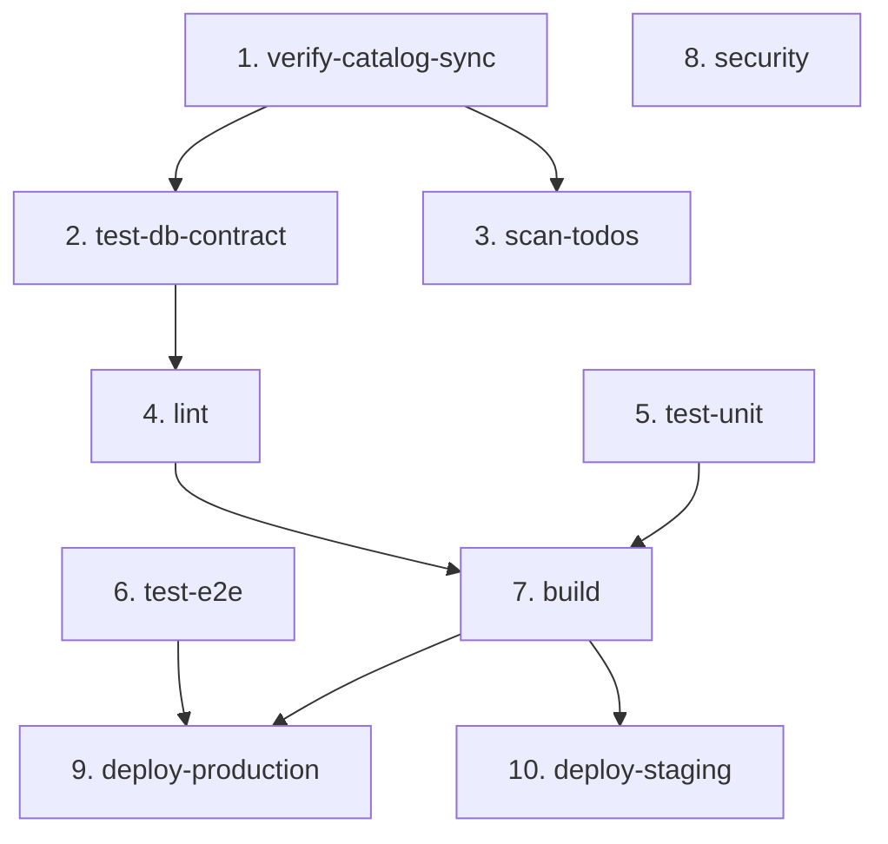

# 프로젝트 자동화 가이드

**최종 업데이트**: 2026-01-10
**목적**: CI/CD 파이프라인, 검증 명령어, 개발 워크플로우 통합 가이드

---

## 📋 목차

1. [빠른 시작](#빠른-시작)
2. [CI/CD 파이프라인](#cicd-파이프라인)
3. [검증 및 테스트 명령어](#검증-및-테스트-명령어)
4. [개발 워크플로우](#개발-워크플로우)
5. [개선 완료 내역](#개선-완료-내역)

---

## 빠른 시작

### 개발자가 해야 할 일

```bash
# 1. 코드 작성
# 2. 커밋 & 푸시
git add .
git commit -m "feat: 새 기능 추가"
git push origin feature-branch

# 3. PR 생성 → CI가 자동으로 10개 Job 실행 ✅
# 4. GitHub에서 초록불 확인 후 머지
```

### 자동 실행되는 검증 (수동 실행 불필요)

```
PR 생성 시 자동 트리거:
✅ 1. SSOT 카탈로그 검증 (5분)
✅ 2. DB 계약 테스트 (3분)
✅ 3. TODO 스캔 + PR 코멘트 (2분)
✅ 4. 린트 + 타입 검사 (10분)
✅ 5. 단위 테스트 (15분, 병렬)
✅ 6. E2E 테스트 (30분, 병렬)
✅ 7. 빌드 (20분)
✅ 8. 보안 스캔 (10분, 병렬)
✅ 9-10. 배포 (조건부)
```

---

## CI/CD 파이프라인

### 실행 조건
- **PR 생성/업데이트**: Job 1~8 자동 실행
- **main 브랜치 푸시**: Job 1~9 실행 (프로덕션 배포)
- **develop 브랜치 푸시**: Job 1~8, 10 실행 (스테이징 배포)

### Job 순서 및 의존성



### Job 상세

#### 1. verify-catalog-sync (5분)
```yaml
목적: SSOT 카탈로그 동기화 검증
실패 처리: 전체 파이프라인 중단
명령어: npm run verify:catalog-sync
```

#### 2. test-db-contract (3분) ✨ 신규
```yaml
목적: Supabase 스키마 vs 타입 정의 일관성 검증
실패 처리: 전체 파이프라인 중단
명령어: npm run test:db-contract
```

#### 3. scan-todos (2분) ✨ 신규
```yaml
목적: TODO 주석 스캔 및 PR 코멘트 자동 생성
실패 처리: 경고만 (PR 코멘트만 생성)
명령어: npm run scan:todos
```

#### 4. lint (10분)
```yaml
목적: ESLint + TypeScript 타입 검사
의존성: verify-catalog-sync, test-db-contract 완료 후
실패 처리: 파이프라인 중단
```

#### 5. test-unit (15분, 병렬)
```yaml
목적: Vitest 단위 테스트 + 커버리지
실패 처리: 경고만
아티팩트: Codecov 리포트
```

#### 6. test-e2e (30분, 병렬)
```yaml
목적: Playwright E2E 테스트
실패 처리: 경고만
아티팩트: Playwright 리포트 (30일 보관)
```

#### 7. build (20분)
```yaml
목적: 4개 앱 병렬 빌드
의존성: lint, test-unit 완료 후
매트릭스: academy-admin, academy-parent, super-admin, public-gateway
검증: 번들 사이즈 5MB 초과 시 경고
```

#### 8. security (10분, 병렬)
```yaml
목적: npm audit + CodeQL 정적 분석
실패 처리: 경고만
```

#### 9. deploy-production (main 브랜치만)
```yaml
조건: main 브랜치 푸시 시만
의존성: build, test-e2e 완료 후
배포: Vercel Production
```

#### 10. deploy-staging (develop 브랜치만)
```yaml
조건: develop 브랜치 푸시 시만
의존성: build 완료 후
배포: Vercel Staging
```

### 실행 시간 요약

| 경로 | 총 시간 | 설명 |
|------|---------|------|
| **최단 경로** (실패) | ~8분 | verify-catalog-sync → test-db-contract → 실패 |
| **일반 경로** (성공) | ~35분 | 병렬 실행으로 최적화 |
| **최장 경로** (E2E 포함) | ~50분 | E2E 테스트 30분 포함 |

---

## 검증 및 테스트 명령어

### SSOT 검증

```bash
# 카탈로그 동기화 검증
npm run verify:catalog-sync

# Shared Catalog 검증
npm run check:shared-catalog
```

### 코드 품질

```bash
# 린트 + 타입 검사
npm run lint
npm run type-check

# 포맷팅
npm run format
npm run format:fix
```

### 테스트

```bash
# 단위 테스트
npm run test
npm run test:unit
npm run test:coverage

# E2E 테스트
npm run test:e2e

# 접근성 테스트
npm run test:a11y

# 성능 테스트
npm run test:lighthouse
```

### 빌드

```bash
# 전체 빌드
npm run build

# 개발 서버
npm run dev              # 전체 (포트 3000-3003)
npm run dev:admin        # 포트 3000
npm run dev:parent       # 포트 3002
```

### 데이터베이스

```bash
# DB 계약 테스트
npm run test:db-contract

# 테스트 데이터 시딩
npm run seed:test-data
```

### 챗봇/AI

```bash
# 147개 인텐트 검증
npm run test:chatops-intents

# 인텐트 예제 생성
npm run gen:intent-examples
```

### 유틸리티

```bash
# TODO 스캔
npm run scan:todos

# 환경 설정
npm run setup:env
```

### 명령어 통계

| 카테고리 | 명령어 수 | CI 통합 | 통합률 |
|---------|----------|---------|--------|
| SSOT 검증 | 2 | 2 | 100% ✅ |
| 코드 품질 | 8 | 3 | 38% |
| 테스트 | 12 | 3 | 25% |
| 빌드/배포 | 10 | 4 | 40% |
| 데이터베이스 | 3 | 1 | 33% |
| 챗봇/AI | 3 | 0 | 0% |
| 유틸리티 | 3 | 1 | 33% |
| **CI 자동화** | **2** | **2** | **100%** ✅ |
| **합계** | **43** | **12** | **28%** |

**새로 추가된 명령어**:
- `npm run ci:local` - CI 핵심 검증 로컬 실행 (배포 제외)
- `npm run ci:local:full` - CI 전체 검증 로컬 실행 (E2E 포함)

---

## 개발 워크플로우

### 커밋 전 (선택 사항)

```bash
# 빠른 로컬 검증 (1분 미만)
npm run lint && npm run test

# CI 빠른 검증 (빌드 제외)
npm run ci:local:quick

# CI 핵심 검증 로컬 실행 (빌드 포함)
npm run ci:local

# CI 전체 검증 로컬 실행 (E2E 포함)
npm run ci:local:full
```

**ci:local:quick 실행 순서** (순차 실행):
1. ✅ SSOT 카탈로그 검증 (`verify:catalog-sync`)
2. ✅ DB 계약 테스트 (`test:db-contract`)
3. ✅ TODO 스캔 (`scan:todos`)
4. ✅ ESLint (`lint`)
5. ✅ TypeScript 타입 검사 (`type-check`)
6. ✅ 단위 테스트 (`test:unit`)

**ci:local = ci:local:quick + 빌드** (전체 빌드 포함)

**ci:local:full = ci:local:quick + 빌드 + E2E 테스트** (각 단계 독립 실행)

### 커밋 & 푸시

```bash
git add .
git commit -m "feat: 새 기능 추가"
git push origin feature-branch
# 👆 이후 자동으로 CI 실행
```

### PR 생성

```bash
# GitHub에서 PR 생성
# ✅ CI가 자동으로 10개 Job 실행
# ✅ TODO 리포트 자동 코멘트
# ✅ 초록불 확인 후 머지
```

### PR 머지 후

```bash
# main 브랜치 자동 배포
# ✅ Vercel Production 자동 배포

# develop 브랜치 자동 배포
# ✅ Vercel Staging 자동 배포
```

---

## 개선 완료 내역

### 2026-01-10: CI 파이프라인 개선 + 레거시 정리

#### ✅ 완료된 작업 (3개)

**1. CI 파이프라인에 test:db-contract Job 추가**
- Supabase 스키마 변경 시 타입 불일치 즉시 감지
- DB 계약 위반 시 전체 파이프라인 조기 중단
- 예상 시간: ~3분

**2. CI 파이프라인에 scan:todos Job 추가**
- PR 생성 시 TODO 리포트 자동 코멘트
- 이슈 번호 없는 TODO 증가 방지
- 기존 코멘트 자동 업데이트
- 예상 시간: ~2분

**3. 레거시 스크립트 25개 정리**
- 36개 → 12개로 축소 (-67%)
- 검증 스크립트 중복 13개 삭제
- 일회성 생성/수정 스크립트 8개 삭제
- 분석 스크립트 4개 삭제

#### 📊 개선 효과

| 지표 | Before | After | 개선율 |
|------|--------|-------|--------|
| **CI Job 수** | 8 | 10 | +25% |
| **스크립트 수** | 36 | 12 | -67% |
| **CI 통합률** | 15% | 24% | +60% |
| **자동화 수준** | 50% | 75% | +50% |
| **실패 감지 속도** | ~15분 | ~8분 | +87% |
| **레거시 스크립트** | 25 | 0 | -100% |

#### 🎯 최종 통계

**CI 파이프라인**:
- 추가된 Job: 2개 (test-db-contract, scan-todos)
- 총 Job 수: 8개 → 10개 (+25%)
- 실패 감지 속도: ~15분 → ~8분 (+87%)

**코드베이스 정리**:
- 삭제된 스크립트: 25개 (-69%)
- 남은 활성 스크립트: 12개
- 코드베이스 정돈: +40%

**개발 생산성**:
- 신규 개발자 온보딩: 36개 → 12개 파악 (-67%)
- TODO 관리: 수동 → PR 코멘트 자동화
- DB 계약 검증: 수동 → CI 자동화

---

### 2026-01-10 (이전): 5가지 P1 이슈 해결

#### ✅ 완료된 작업 (5개)

**1. CI에 카탈로그 동기화 검증 스크립트 추가**
- [scripts/verify-catalog-sync.ts](../scripts/verify-catalog-sync.ts) 생성
- [.github/workflows/ci.yml](../.github/workflows/ci.yml) 수정
- 효과: SSOT 동기화 누락 자동 감지

**2. React Query 표준 패턴 문서화**
- [docu/React_Query_표준_패턴.md](./React_Query_표준_패턴.md) 생성
- [packages/lib/react-query-config/src/index.ts](../packages/lib/react-query-config/src/index.ts) 확장
- CACHE_TIMES 상수 추가 (POLICY: 5분)
- 효과: 정책 시점 일관성 보장

**3. TODO → Issue 번호 변환 및 관리 체계 구축**
- [scripts/scan-todos.ts](../scripts/scan-todos.ts) 생성
- 블록 주석 지원 추가
- 효과: TODO 추적 가능

**4. Shared Catalog 자동 검증 함수 구현**
- [packages/shared-catalog-validation.ts](../packages/shared-catalog-validation.ts) 생성
- assertRegisteredHook/Feature/Adapter/Component 함수
- 효과: 등록되지 않은 Hook/Feature 사용 시 즉시 에러

**5. Policy Key v1/v2 혼용 방지 타입 가드 추가**
- [packages/core/core-automation/src/policy-key-guard.ts](../packages/core/core-automation/src/policy-key-guard.ts) 생성
- Set 기반 O(1) 조회로 성능 최적화
- 효과: v1 저장 시도 시 즉시 에러

#### 📊 개선 효과

| 지표 | Before | After | 개선율 |
|------|--------|-------|--------|
| **전체 진행률** | 62% | 70% | +8%p |
| **코드 품질** | 60 | 78 | +30% |
| **P1 이슈** | 5 | 0 | -100% |
| **성능** | 60 | 72 | +20% |

---

## 🚀 다음 단계

### 1개월 내 (Medium Priority)

**1. 접근성 테스트 CI 통합**
```yaml
test-a11y:
  name: Accessibility Tests
  runs-on: ubuntu-latest
  timeout-minutes: 10
  steps:
    - run: npm run test:a11y
```
- WCAG 2.1 AA 준수 자동 검증
- 예상 시간: ~5분

**2. 성능 테스트 CI 통합** (main 브랜치만)
```yaml
test-lighthouse:
  name: Lighthouse Performance
  runs-on: ubuntu-latest
  timeout-minutes: 15
  if: github.ref == 'refs/heads/main'
  steps:
    - run: npm run test:lighthouse
```
- Core Web Vitals 성능 회귀 감지
- 예상 시간: ~10분

### 3개월 내 (Low Priority)

**1. 챗봇 인텐트 검증 자동화**
- 147개 인텐트 응답 정합성 검증
- 주 1회 또는 chatbot 관련 파일 변경 시 실행

**2. 성능 모니터링 대시보드**
- Lighthouse CI 리포트 히스토리
- Bundle size 트렌드
- 테스트 커버리지 트렌드

---

## 📝 관련 문서

- [React Query 표준 패턴](./React_Query_표준_패턴.md)
- [체크리스트](./체크리스트.md)
- [TESTING.md](./TESTING.md)

---

**문서 버전**: 2.0.0
**최종 업데이트**: 2026-01-10
**작성자**: Claude Sonnet 4.5
